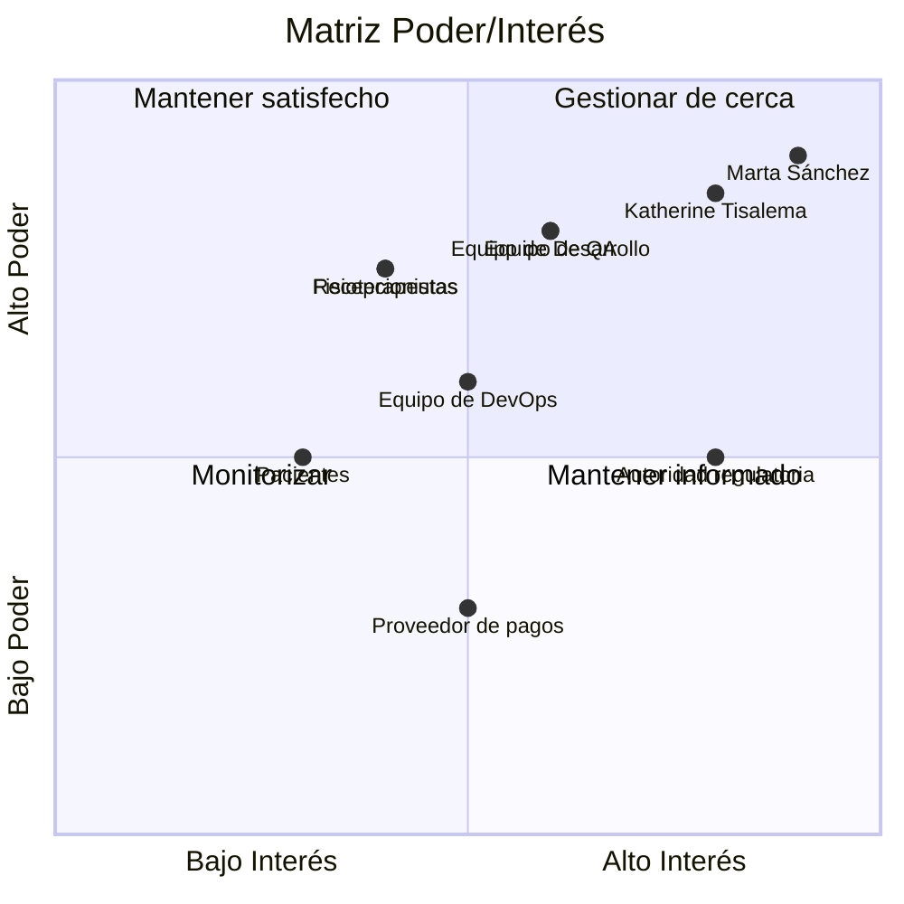

# Registro de interesados
 
| Interesado | Rol/Interés | Poder | Interés | Estrategia |
|---|---|---|---|---|
| Marta Sánchez | Gerente de FisioVital y patrocinadora | Alto | Alto | Gestionar de cerca |
| Katherine Tisalema | Jefe de Proyecto | Alto | Alto | Gestionar de cerca |
| Equipo de Desarrollo | Implementación técnica | Medio | Alto | Mantener satisfecho |
| Equipo de QA | Aseguramiento de calidad | Medio | Alto | Mantener satisfecho |
| Equipo de DevOps | Infraestructura y despliegues | Medio | Medio | Mantener informado |
| Recepcionistas | Usuarias finales del sistema de citas | Bajo | Alto | Mantener informados |
| Fisioterapeutas | Usuarios finales del módulo de pacientes y citas | Bajo | Alto | Mantener informados |
| Pacientes | Beneficiarios del servicio | Bajo | Medio | Monitorizar |
| Proveedor de pagos | Servicio externo de cobros | Medio | Bajo | Mantener informado |
| Autoridad regulatoria | Cumplimiento de datos y protección de la información | Alto | Medio | Gestionar de cerca |

