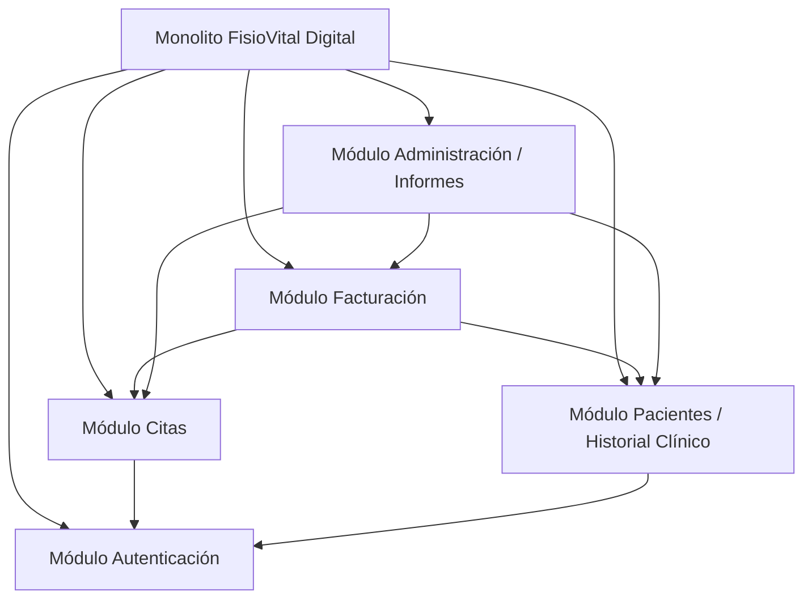

# ADR 001 — Arquitectura monolítica modular
 
## Estado
Aceptada
 
## Contexto
FisioVital es un sistema de gestión integral para clínicas de fisioterapia, diseñado para administrar usuarios, citas, pacientes, historiales clínicos, informes y facturación. El sistema debe centralizar toda la información administrativa de la clínica en una plataforma única y accesible.

Las principales restricciones son:
- Presupuesto de desarrollo limitado (25.000€–35.000€)
- Plazo de desarrollo limitado (3 meses)
- Desarrollo inicial básico sin integraciones externas complejas
- Requerimientos funcionales claros para 5 módulos principales
 
## Decisión
Se adopta una arquitectura **monolítica modular**, con un único paquete desplegable dividido en los siguientes módulos:
- Autenticación / Usuarios
- Citas
- Pacientes / Historial Clínico
- Facturación
- Administración / Informes
 

 
## Alternativas consideradas
| Alternativa | Ventajas | Inconvenientes |
|---|---|---|
| Microservicios |  Escalado independiente, despliegue por servicio, mayor flexibilidad tecnológica  | Mayor complejidad, más infraestructura, mayor coste operativo |
| Monolito no modular | Desarrollo inicial sencillo, estructura simple | Difícil mantenimiento, alto acoplamiento, crecimiento complicado |
| Monolito modular (elegida) | Buena organización por módulos, menor complejidad, despliegue único, mantenimiento sencillo | Escalado menos flexible que microservicios |
 
## Consecuencias
### Positivas
- Desarrollo más rápido para un equipo pequeño.
- Despliegue sencillo mediante una única aplicación.
- Menor coste de infraestructura y mantenimiento.
- Fácil comunicación entre módulos dentro del mismo proceso.
- Organización clara del código mediante separación funcional por dominio.

### Negativas
- Escalabilidad limitada respecto a una arquitectura de microservicios.
- Un fallo crítico puede afectar a toda la aplicación.
- Las actualizaciones requieren desplegar el sistema completo.
- El crecimiento excesivo del proyecto puede aumentar el acoplamiento.
 
## Condiciones que aconsejarían migrar en el futuro
- Incremento significativo del número de usuarios concurrentes.
- Necesidad de escalar módulos específicos de forma independiente.
- Crecimiento del equipo de desarrollo en varios equipos autónomos.
- Requisitos de alta disponibilidad para determinados servicios.
- Integración con múltiples sistemas externos complejos.
- Aumento considerable del tamaño y complejidad del sistema.

## Reparto de módulos por rol
| Módulo | Responsable principal | Apoyo |
|---|---|---|
| Autenticación | Backend | DevOps, QA |
| Citas | Backend + Frontend | QA, DevOps |
| Pacientes/Historial Clínico | Backend | Frontend, QA |
| Facturación | Backend + Frontend | QA, DevOps |
| Administración/Informes | Frontend | Backend, QA |

