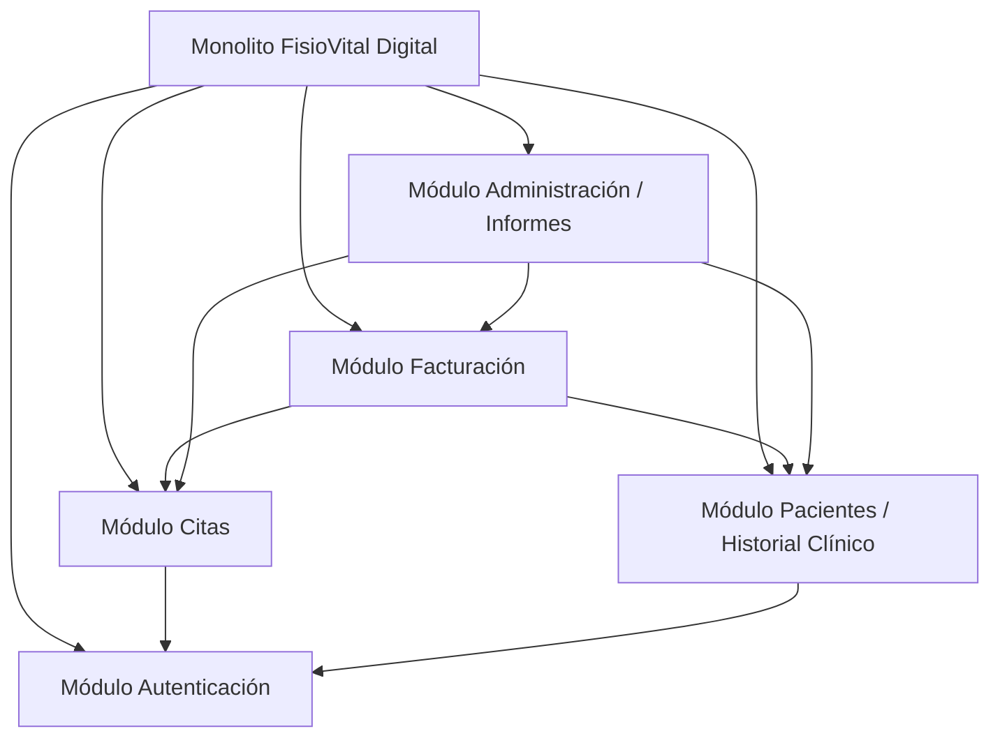

# ADR 001 — Arquitectura monolítica modular
 
## Estado
Aceptada
 
## Contexto
FisioVital es un sistema básico para la gestión de citas y pacientes. Por lo que se espera llegar a administrar las 5 clinicas  usuarios, citas, pacintes, historiales clinicos, informes y facturación.
Las principales restricciones son:
- Presupuesto de desarrollo limitado
- Tiempo de desarrollo limitado
- Desarrollo inicial básico
- Centralizar la información administratica  de la clinica en una sola pagina
- 
 
## Decisión
Se adopta una arquitectura **monolítica modular**, con un único desplegable
dividido en los siguientes módulos:
- Autenticación / Usuarios
- Citas
- Pacientes / Historial Clínico
- Facturación
- Administración / Informes
 

 
## Alternativas consideradas
| Alternativa | Ventajas | Inconvenientes |
|---|---|---|
| Microservicios |  Escalado independiente, despliegue por servicio, mayor flexibilidad tecnológica  | Mayor complejidad, más infraestructura, mayor coste operativo |
| Monolito no modular | Desarrollo inicial sencillo, estructura simple | Difícil mantenimiento, alto acoplamiento, crecimiento complicado |
| Monolito modular (elegida) | Buena organización por módulos, menor complejidad, despliegue único, mantenimiento sencillo | Escalado menos flexible que microservicios |
 
## Consecuencias
- ### Positivas
- Desarrollo más rápido para un equipo pequeño.
- Despliegue sencillo mediante una única aplicación.
- Menor coste de infraestructura y mantenimiento.
- Fácil comunicación entre módulos.
- Organización clara del código mediante separación funcional.

### Negativas
- Escalabilidad limitada respecto a una arquitectura de microservicios.
- Un fallo crítico puede afectar a toda la aplicación.
- Las actualizaciones requieren desplegar el sistema completo.
- El crecimiento excesivo del proyecto puede aumentar el acoplamiento.
 
## Condiciones que aconsejarían migrar en el futuro
- Incremento significativo del número de usuarios concurrentes.
- Necesidad de escalar módulos específicos de forma independiente.
- Crecimiento del equipo de desarrollo en varios equipos autónomos.
- Requisitos de alta disponibilidad para determinados servicios.
- Integración con múltiples sistemas externos complejos.
- Aumento considerable del tamaño y complejidad del sistema.

## Reparto de módulos por rol
| Módulo | Responsable principal | Apoyo |
|---|---|---|
| Autenticación | Backend | DevOps |
| Citas | Backend + Frontend | QA |
| Pacientes/Historial | Backend | QA |
| Facturación | Backend + Frontend | QA |
| Administración/Informes | Frontend | Backend |

