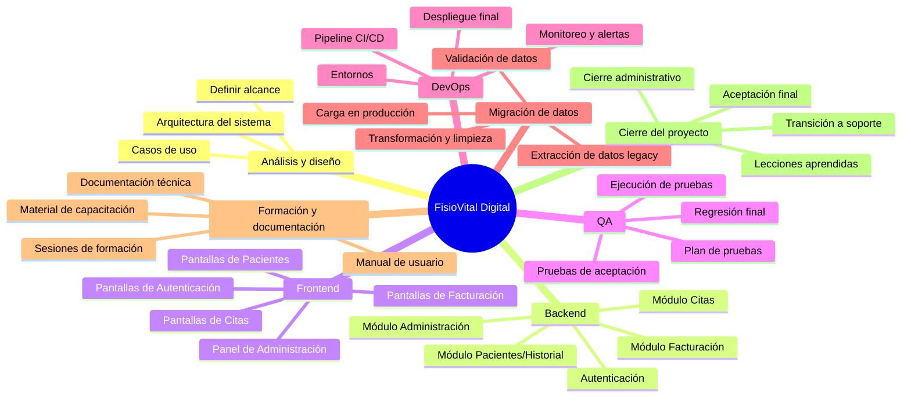

# EDT / WBS — FisioVital Digital
 

```mermaid
mindmap
  root((FisioVital Digital))
    Análisis y diseño
      Definir alcance
      Casos de uso
      Arquitectura del sistema
    Backend
      Autenticación
      Módulo Citas
      Módulo Pacientes/Historial
      Módulo Facturación
      Módulo Administración
    Frontend
      Pantallas de Autenticación
      Pantallas de Citas
      Pantallas de Pacientes
      Pantallas de Facturación
      Panel de Administración
    QA
      Plan de pruebas
      Ejecución de pruebas
      Regresión final
      Pruebas de aceptación
    DevOps
      Entornos
      Pipeline CI/CD
      Despliegue final
      Monitoreo y alertas
    Migración de datos
      Extracción de datos legacy
      Transformación y limpieza
      Validación de datos
      Carga en producción
    Formación y documentación
      Manual de usuario
      Material de capacitación
      Documentación técnica
      Sesiones de formación
    Cierre del proyecto
      Aceptación final
      Lecciones aprendidas
      Cierre administrativo
      Transición a soporte
```
