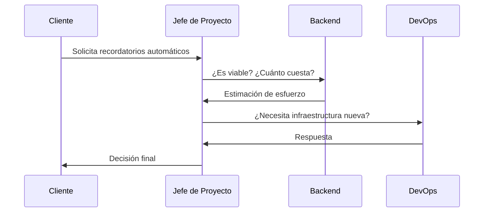

# CR-001 — Solicitud de cambio: recordatorios automáticos de cita
 
## Solicitante
Marta Sánchez (Gerente FisioVital)
 
## Descripción de la solicitud
Se solicita incorportr la funcionalidad de recordadorio de citas automaticas en un lapso de 24h mediante correo electrocico o mensaje de texto y con opcion a cancelación, para evitar aucencias de los pacientes
 
## Análisis de impacto
**Alcance:** Se requiere ampliar el módulo de Citas para incluir la gestión de recordatorios automáticos. Será necesario añadir nuevas configuraciones de aviso y adaptar la API para gestionar el envío de notificaciones.
Estimación aproximada de 2 semanas adicionales de desarrollo, pruebas e integración.

**Coste:**  
Incremento estimado de 2.500 € debido al esfuerzo adicional de Backend, configuración DevOps y pruebas QA.

**Riesgos:**  
- Dependencia de servicios externos de mensajería o correo.
- Posibles problemas de entrega de notificaciones.
- Necesidad de cumplir requisitos de privacidad y protección de datos.
- Aumento de carga en el sistema si crece el número de avisos enviados.
 
## Recomendación técnica
**Backend:**  
La implementación es viable. Se recomienda añadir un servicio de notificaciones asociado al módulo de Citas, con tareas programadas para revisar próximas citas y generar los avisos correspondientes.

**DevOps:**  
No requiere nueva infraestructura crítica. Será necesario configurar variables de entorno, credenciales del servicio de envío y monitorización básica de los procesos automáticos.

**QA:**  
Se recomienda incluir pruebas de envío correcto, cancelación de citas, modificación de horarios y fallos del servicio externo.

## Decisión
[Aceptado / Rechazado / Aceptado con condiciones] — Fecha: 26/06/2026

Condiciones:
- Implementar primero recordatorios por correo electrónico.
- Revisar posteriormente la incorporación de SMS o WhatsApp.
- Mantener control de costes y tiempos antes de ampliar el alcance.

 

