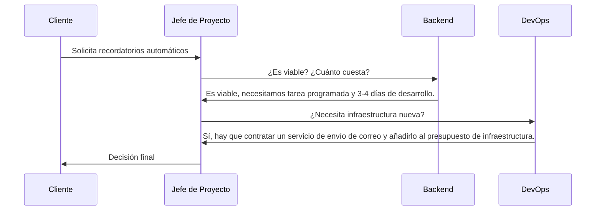

# CR-001 — Solicitud de cambio: recordatorios automáticos de cita
 
## Solicitante
Marta Sánchez (Gerente FisioVital)
 
## Descripción de la solicitud
Se solicita incorporar la funcionalidad de recordatorios de citas automáticos 24 horas antes, preferiblemente por correo electrónico, con opción a cancelación desde el aviso. El objetivo es reducir ausencias y optimizar el uso de las horas disponibles.
 
## Análisis de impacto
**Alcance:** Ampliar el módulo de Citas para gestionar recordatorios automáticos 24 horas antes. Incluye crear una tarea programada que revise las citas del día siguiente, generar avisos por correo electrónico y permitir cancelación desde el aviso. Estimación aproximada de 2 semanas adicionales de desarrollo, pruebas e integración.

**Coste:** Incremento estimado de 2.500 € por el esfuerzo adicional de Backend, configuración DevOps y pruebas QA. Existe un margen de hasta 3.000 € adicionales si es necesario.

**Riesgos:**
- Dependencia de un servicio de correo externo.
- Posibles problemas de entrega de notificaciones.
- Requisitos de privacidad y protección de datos.
- Aumento de la carga en el sistema si se envía un volumen alto de avisos.
- Posibles problemas de entrega de notificaciones.
## Recomendación técnica
**Backend:**
Es viable. Ya tenemos el email del paciente guardado; necesitamos una tarea programada que revise las citas del día siguiente. Calculo unos 3-4 días de desarrollo.

**DevOps:**
Para enviar emails automáticos necesitamos contratar un servicio de envío de correo, eso no estaba presupuestado: hay que añadirlo al presupuesto de infraestructura.

**QA:**
Se recomienda incluir pruebas de envío correcto, cancelación de citas desde el recordatorio, modificación de horarios y fallos del servicio externo.

## Decisión
 Aceptado con condiciones — Fecha: 26/06/2026

Condiciones:
- Implementar primero recordatorios por correo electrónico.
- Revisar SMS solo si queda tiempo y presupuesto.
- Mantener control de costes y tiempos antes de ampliar el alcance.

