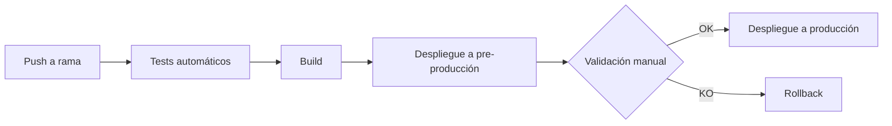

# Estrategia de despliegue — FisioVital Digital

## Entornos

| Entorno | Propósito |
|---|---|
| Desarrollo | Entorno utilizado por Backend y Frontend para implementar nuevas funcionalidades, realizar pruebas iniciales y validar cambios durante el desarrollo. |
| Pre-producción | Entorno idéntico a producción destinado a pruebas finales, validación funcional, pruebas de integración y aprobación antes del despliegue definitivo. |
| Producción | Entorno final utilizado por usuarios reales donde se ejecuta la versión estable del sistema. |

---

## Pipeline CI/CD

---

## Estrategia de despliegue a producción

El despliegue a producción seguirá un proceso controlado para minimizar riesgos:

1. **Preparación del lanzamiento**
   - Confirmar que todas las pruebas automáticas han finalizado correctamente.
   - Verificar que los casos críticos de QA están aprobados.
   - Revisar que no existen incidencias bloqueantes abiertas.
   - Crear una copia de seguridad de la versión actual en producción.

2. **Validación en pre-producción**
   - Desplegar la versión candidata en el entorno de pre-producción.
   - Ejecutar pruebas funcionales y de integración.
   - Validar especialmente los módulos modificados.
   - Obtener aprobación del responsable del proyecto.

3. **Paso a producción**
   - Programar la ventana de despliegue.
   - Desplegar la nueva versión mediante el pipeline CI/CD.
   - Ejecutar pruebas rápidas de verificación:
     - Inicio de sesión.
     - Creación de citas.
     - Consulta de pacientes.
     - Generación de facturas.
     - Estado del sistema.

4. **Plan de rollback**
   - Si aparece un error crítico, se detendrá el despliegue.
   - Se restaurará la versión estable anterior.
   - Se recuperará la base de datos mediante la copia de seguridad si fuera necesario.
   - Se analizará la causa del fallo antes de un nuevo intento.

---

## Lección aplicada tras INC-001

Tras la incidencia INC-001 se incorporan las siguientes mejoras:

- Añadir validaciones automáticas adicionales antes del despliegue.
- No permitir despliegues a producción si existen fallos en tests del pipeline.
- Incorporar revisión obligatoria del estado del pipeline antes de aprobar una versión.
- Registrar cambios de configuración de infraestructura mediante control de versiones.
- Añadir alertas automáticas para detectar errores inmediatamente después del despliegue.
- Documentar los pasos de recuperación y rollback para reducir tiempos de respuesta.

---

## Checklist de salida a producción

- [ ] Todas las pruebas automáticas del pipeline han finalizado correctamente.
- [ ] QA ha aprobado la versión candidata.
- [ ] No existen incidencias críticas abiertas.
- [ ] Se ha realizado copia de seguridad de la aplicación y base de datos.
- [ ] Las variables de entorno de producción están verificadas.
- [ ] La versión desplegada coincide con la aprobada en pre-producción.
- [ ] Se ha informado al equipo del inicio del despliegue.
- [ ] Se han realizado pruebas básicas después del despliegue.
- [ ] La monitorización del sistema está activa.
- [ ] Se ha confirmado la estabilidad del sistema tras la puesta en producción.