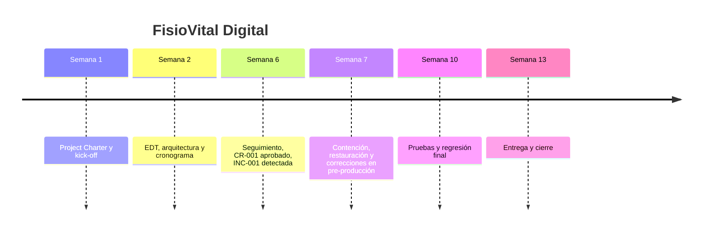

# Postmortem — FisioVital Digital

## Resumen ejecutivo
La noche del 23 de junio se detectó una caída del entorno de pre-producción que dejó la aplicación inaccesible durante ~14 horas y obligó a posponer las pruebas planificadas. La incidencia (INC-001) fue causada por un cambio erróneo en una variable de entorno de conexión a la base de datos introducido sin validación previa; se restauró la configuración y se recuperó el servicio sin pérdida de datos. En respuesta se han aplicado medidas inmediatas y se proponen acciones para reducir la probabilidad de repetición.

## Línea temporal

## Qué funcionó bien
- Detección y comunicación rápida por parte del equipo de QA.
- Restauración eficiente de la configuración y reinicio de servicios por el equipo técnico.
- Existencia de un pipeline CI/CD y procedimientos de despliegue que permitieron analizar y mitigar el impacto.
- Los criterios de aceptación y el plan de pruebas estaban definidos, lo que facilitó la validación posterior a la recuperación.

## Qué no funcionó: análisis de causa raíz (5 porqués) de INC-001
1. ¿Por qué se cayó el entorno de pre-producción? Porque se cambió una variable de entorno de conexión a la base de datos y la aplicación no pudo arrancar.
2. ¿Por qué se cambió la variable sin control? Porque el cambio se aplicó directamente sin validaciones automáticas ni pruebas en un entorno seguro.
3. ¿Por qué no hubo validaciones previas? Porque no existía una comprobación automática de consistencia de variables de entorno en el pipeline ni una revisión obligatoria de cambios de configuración.
4. ¿Por qué no había revisión obligatoria? Porque las variables de infraestructura no estaban versionadas ni sujetas a un proceso de control de cambios formal dentro del flujo de despliegue.
5. ¿Por qué no se versionaron ni controlaron? Falta de estándares y checklist claros para cambios de configuración, y ausencia de formación específica sobre gestión de configuración para quienes realizan despliegues.

**Causa raíz:** Falta de controles y validaciones en el proceso de despliegue para cambios en la configuración de infraestructura (variables de entorno), unido a un proceso de revisión de cambios insuficiente.

## Impacto de la arquitectura monolítica modular en el cierre
La arquitectura monolítica modular facilitó el despliegue único y la restauración rápida de la versión anterior (beneficio operativo), pero también aumentó el radio de impacto de un cambio erróneo en la configuración (mayor blast radius). En general, la modularidad interna ayudó a aislar problemas a nivel de código, pero la existencia de un único despliegue hizo que una mala configuración afectara a todos los módulos simultáneamente.

## Acciones tomadas inmediatamente
- Identificación y restauración de la configuración válida en pre-producción, reinicio de servicios y verificación de integridad (recuperación en ~14 horas).
- Actualización inmediata del pipeline y checklist de despliegue para incluir validaciones básicas de configuración y comprobaciones previas al arranque.
- Registro de la incidencia y comunicación a stakeholders; bloqueo temporal de despliegues hasta validación post-incidencia.

## Recomendaciones y acciones correctivas (con responsables y plazo sugerido)
- Implementar validaciones automáticas de variables de entorno en el pipeline (DevOps) — plazo: 2 semanas.
- No permitir despliegues a entornos críticos si existen fallos en tests automatizados (DevOps/QA) — plazo: 1 semana.
- Versionar la configuración de infraestructura y variables sensibles en control de código (DevOps) — plazo: 3 semanas.
- Añadir una checklist obligatoria de revisión de cambios de configuración con aprobación de un responsable (Jefe de Proyecto/DevOps) — plazo: 1 semana.
- Crear un runbook de recuperación y rollback documentado y probado (DevOps) — plazo: 2 semanas.
- Formación rápida para el personal que realiza despliegues sobre gestión de configuración y uso seguro del pipeline (Jefe de Proyecto) — plazo: 2 semanas.
- Automatizar alertas tempranas tras despliegues para detectar errores inmediatamente (DevOps) — plazo: 2 semanas.

## Lecciones aprendidas
- Las variables de entorno y cambios de configuración deben tratarse con el mismo rigor que el código: revisión, versionado y pruebas.
- Tener un pipeline no basta: debe incorporar validaciones de infraestructura y bloqueos automáticos ante fallos.
- La coordinación entre QA, DevOps y Desarrollo es esencial para reducir el tiempo de recuperación.

## Seguimiento
- Revisar implementación de acciones correctivas en la próxima reunión de seguimiento (2 semanas).
- Cerrar la lección como aplicada cuando todas las acciones estén implementadas y testeadas en staging.

## Referencias
- INC-001 — Caída del entorno de pre-producción (registro de la incidencia)
- Estrategia de despliegue y pipeline CI/CD

